## 一、代码和ai大致思路介绍
### 搜索算法
- 整体采用negamax框架（类似minimax，只是两方的行为一致，都把下一层的返回值取负然后取最大），并使用alpha-beta剪枝提高效率，最终实测在本地中局情况数最多的情况下搜索仍可达9层，botzone平台上可达8层
- 采用试探搜索，先用6层浅层搜索大致确定每步得分，然后进行排序以提高剪枝效率
- 采用迭代加深搜索，由于botzone平台运算速度过于缓慢，改为从7层开始（原本是8层），若搜完当前层用时不到500ms则提高深度再次搜索
- 采用PVS，在正式搜索之前先进行一次零窗口搜索，如果有超过当前分数最大值的潜力再执行正式搜索
    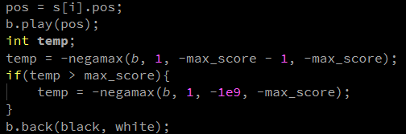
- 偶然间发现botzone平台上的clock()函数执行过于缓慢，会比较严重地降低程序性能（是在写计概作业的时候发现的） 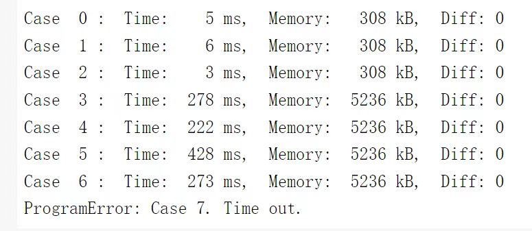
  左图和右图的区别只有增加了卡时
  于是我决定使用多线程的方式进行卡时，方法如下。其实代码写起来非常简单，但是显著了提升了bot的实力（大概从1700分到1900分） 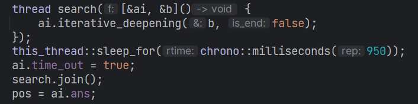
- 后续考虑加入置换表、probcut等技术，但置换表效果应该有限，probcut在目前评分函数准确度不高的情况下效果也不好，所以还未加入
### 评分函数
- 使用位棋盘提高寻找可行位置、落子和评分函数效率
- 使用两个unsigned long long，一个表示黑棋，一个表示白棋
- 寻找可行位置的代码如下图所示（以加入了较详细的注释增加可读性），其他功能的实现方式与此类似
  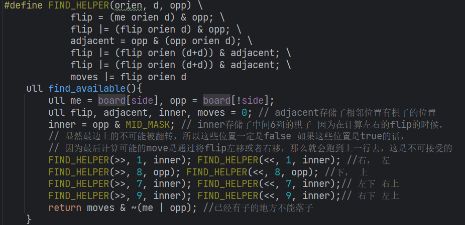
- 最终的评分函数由角落情况、行动力、潜在行动力、稳定性、位置和子数（仅在终局有权重）6个部分组成，并根据游戏阶段改变权重
- 角落情况的计算方式是，角落子每个+20，在对方角落子旁边的星位子每个-10，C位子每个-2，同时角落子旁边如果插入有对方子（对房子的左侧和右侧都是自己子）则-12，如果是空白则-6（现在看来这个好像有点奇怪）
- 行动力顾名思义，就是双方可行位置的个数
- 潜在行动力的计算方式是和对方子相邻的空白位置的数量，也有人使用frontier也就是和空白相邻的对方棋子的个数，但是我个人感觉前者好像更好
- 稳定性包括稳定子、半稳定子和不稳定子三个部分，稳定子就是一定不会被翻转的子，计算方式是角和与角相邻的一坨（其实好像不是很严谨，但差不多够用）；半稳定子是上下左右都是对方的棋子，或者在边上，在对方的两个子中间的子，不稳定子是所有能在下一回合被翻转的子。稳定子每个+5，半稳定子每个+2，不稳定子每个-1
- 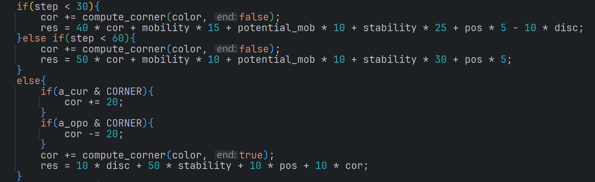 
   最后使用这个权重来计算评分
- 上述方法实际上已经表现的比较不错，截至写实验报告的时候在botzone上是1817分，第31名，并且在90%的情况下能战胜1900多分的HazyAI，可以说已经基本是这种传统方法的天花板了。然而这种方法确实有它的上限，和榜单前三那几个2500分的bot还是有质的差距。于是我想能不能更进一步。
### 实验
目前较强的黑白棋ai均采用模板估值作为评分函数主要方式，模板估值的主要原理为，对于下图所示的每一个模板位置，比如说hor2（棋盘第二行），有3^8种可能的棋子排布，然后用对局数据进行拟合，得到每一种排布的权重，然后在计算某个局面的评分函数的时候，将每一个模板配置的权重相加，就得到当前局面的得分。（当然，权重应该是一个步数的函数，也就是应该随着对局的发展而变化）
 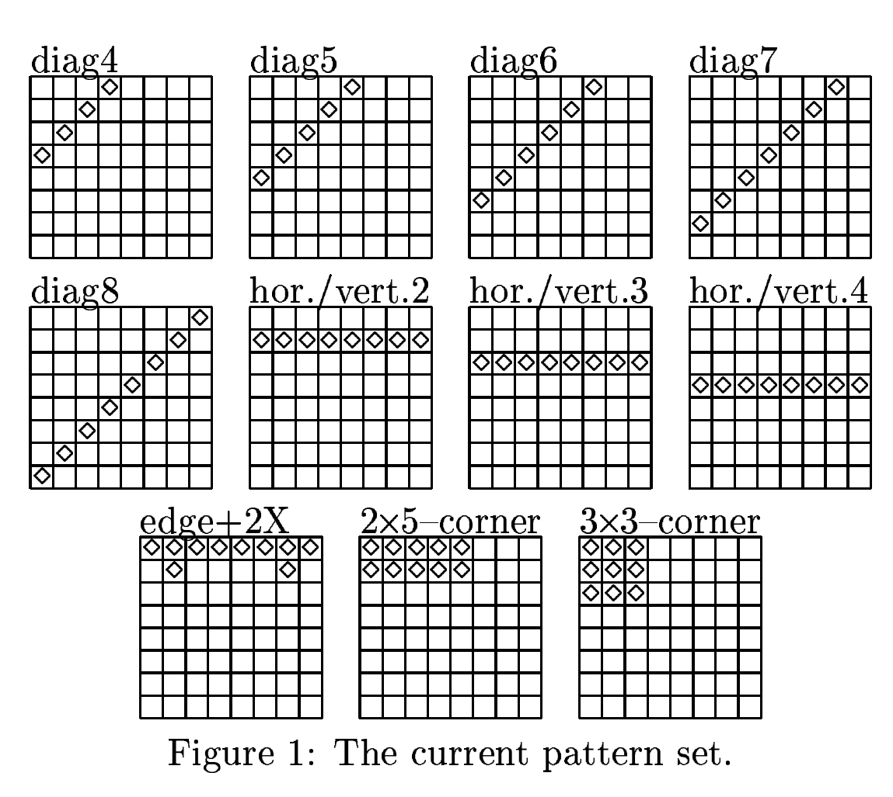
  传统的线性回归的方法显然不太能拟合这个级别的数据，Michael Buro在2000年的文章Experiments with Multi-ProbCut and a New High-Quality Evaluation Function for Othello中提出可以使用机器学习中的反向传播方法（也就是梯度下降）来计算出权重，（2000年，真的很震撼）

然而实际上这种方法忽视了模板和模板之间的联系，线性函数也并不足够拟合出很好的评分函数。（结果实际上是使用这种方法得到的黑白棋ai非常强，远比我那样乱搞出来的强）我想，既然都梯度下降了，为什么不干脆用神经网络来解决这个问题呢？

于是我参考了榜一的strongbwcore的代码，并使用Logistello和Egaroucid的作者开源的对局数据，使用pext指令提取模板配置（pext的作用是把第一个数在第二个数bit为1的对应位置的bit按顺序提取出来，比如说如果第一个数是11011001，第二个数是10001100，就会把第一个数的第8、4、3个bit按顺序提取出来，也就是110，然后返回提取出来的数），由于有黑棋和白棋两方，将黑棋的数据左移模板长度位（如果是diag4模板就是4，edge+2X就是10）再加上白棋数据，就得到一个数，然后再把这个数映射成一个3进制数，就是比如说第一位黑是0白是1就映射成11，黑是1白是0就映射成01这样，就能把每个模板配置转成一个上限是3^模板长度的数。然后使用NLP中的word embedding方法，实际上就是加一个embedding层，然后把它转成一个低维向量，之后再加两个全连接层，使用relu作为激活函数，最后的输出直接就是一个浮点数，表示预测的结果（预计我方会比对方多几个子）

模板提取代码如下：
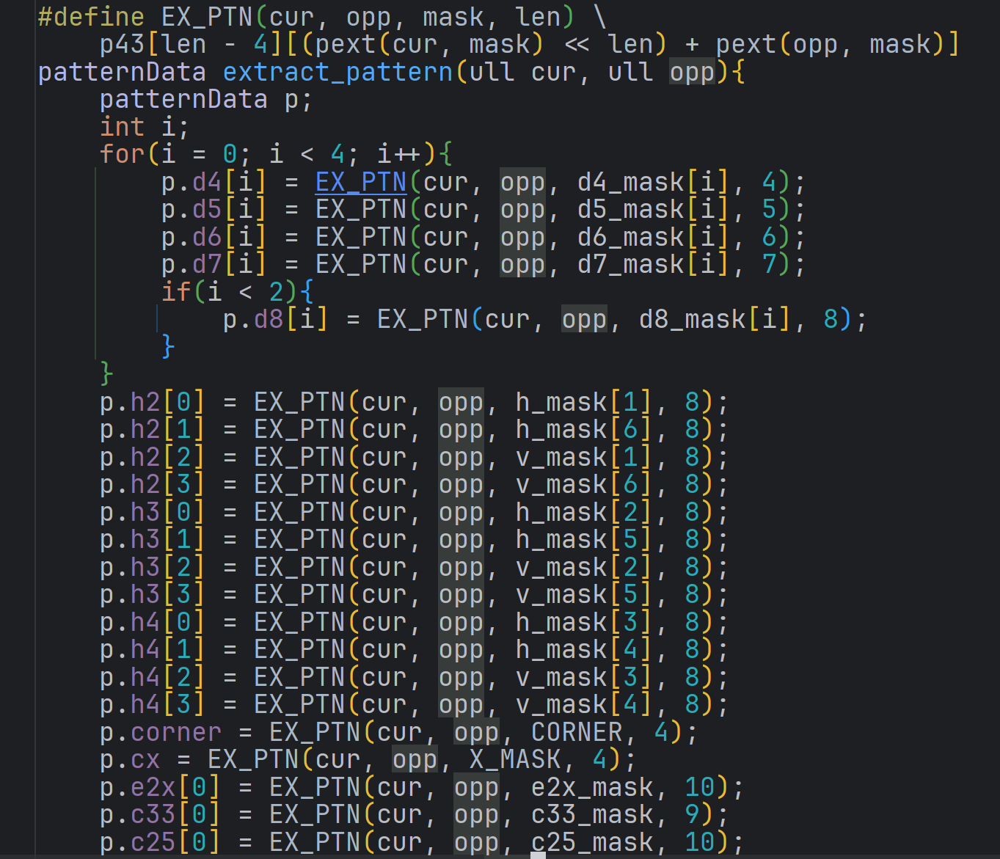

训练代码如下：
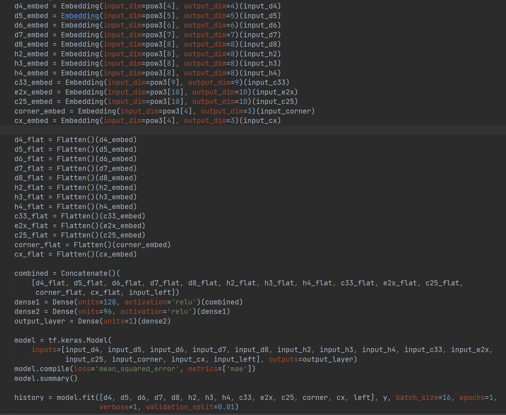
写的有点verbose，但是一天速成keras

然而最后训练的结果似乎有点不尽如人意，我是分了好多个阶段，每个阶段有单独的神经网络，55-60的网络似乎能达到2.几的mae，再往前的网络似乎只能到4左右。而且奇怪的是我拿egaroucid的数据训练半天之后用logistello测试，mae会很高，再用logistello训练一会，egaroucid的mae又上去了。或许是我的训练方法有点问题？ ml的水平确实太差了，还需要学习
 之后用tensorflow的c api，用c调用训练好的模型，和用传统方法评分函数的ai进行的对战，然而并不能打过

事实上在此之前我还使用了直接将64个0和1作为网络的输入的方法，这种方法的mae最低也只能到12左右，显著地不如我后来使用的方法。也考虑过使用卷积神经网络的方法，然而卷积网络适合围棋这种大棋盘，但对于黑白棋8*8的小棋盘大概效果不会很好，尤其是黑白棋中边和角非常重要，然而卷积正是要忽略边角特征，保留中间。因此我并没有尝试卷积神经网络

最后我大致了解了一下MCTS的方法以及alphazero的原理，但是时间有限，我并未进行实践

顺便说一句，在我自己的电脑（2070s）和V100上，训练大概都是10-14ms/step，然而在A100上是3ms/step。A100确实nb！

## 二、功能介绍
### 1.开始界面

  点击“开始游戏"，开始游戏
### 2.游戏界面
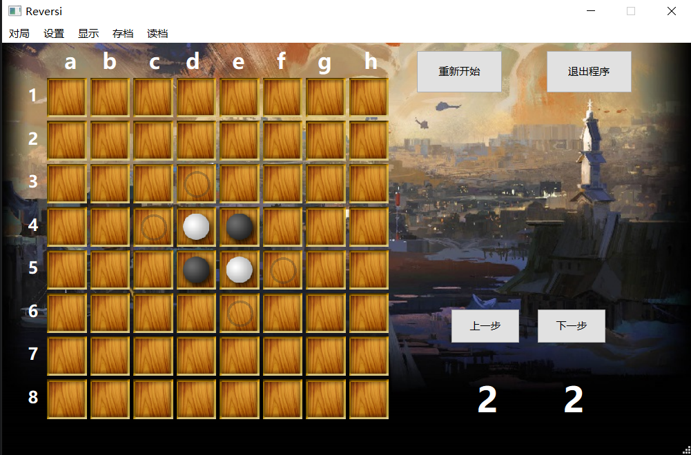
- 页面上有重新开始、退出程序、上一步、下一步四个按钮，以及两个数字代表黑棋和白棋当前棋子数量
- 下棋时如果某一方无子可下会在右侧显示”跳过回合！“并暂停一秒，如果游戏结束会在右侧显示某一方获胜
- 点击重新开始会以当前设置重新开始游戏
- 上一步的功能相当于悔棋，会回到下这一步之前的界面，同理下一步是在悔棋后使用，能重新下刚刚的一步
- 点击退出程序功能与右上角的叉一致，会退出程序，并在退出前询问是否要保存
  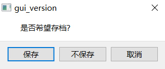
- 点击不保存会直接退出，点击取消会取消退出，点击保存会弹出选择保存路径和文件名界面
 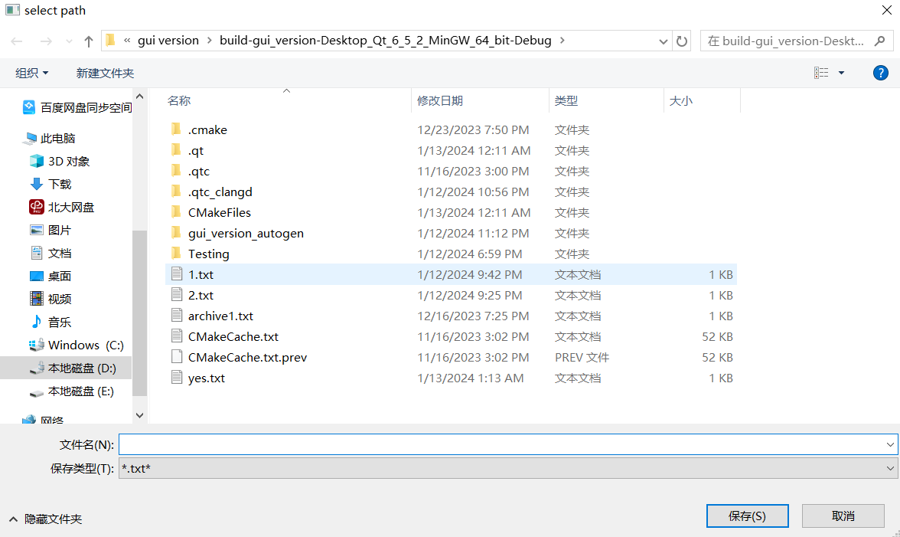
### 3.菜单栏
- 对局菜单中有四个选项，分别是玩家执黑对战电脑，玩家执白对战电脑，ai自己对战，玩家相互对战，点击任意选项后会以对应方式开启新对局
  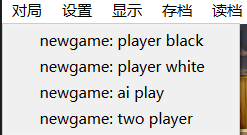
- 设置菜单目前只能用于选择ai难度，分为123，默认难度是3，1难度为采用多子和占角策略ai，2难度为正常评分函数，但是限制搜索深度6层，3难度为完整版ai
 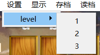
- 显示菜单目前只有显示可行位置一个功能，默认开启，会在棋盘上的可行位置显示黑色圆圈，再点击一次之后会关闭显示可行位置
 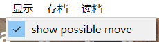
- 存档菜单中有保存到硬盘和保存到剪贴板两个功能，保存到硬盘的界面和之前退出程序时选择保存的界面一样，保存到剪贴板之后会显示出一个剪贴板，玩家可以自行复制。复制完成后点击完成即可回到下棋界面
 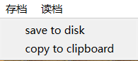
 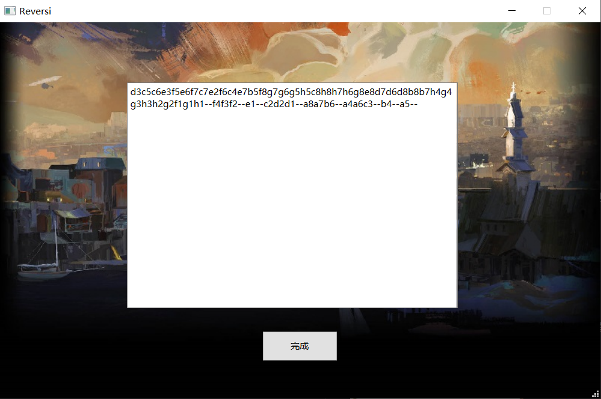
  坐标与棋盘上显示的一致（为黑白棋通用坐标），某一方无子可下时记为--
- 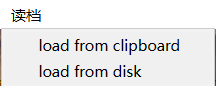
  读档功能同样有从剪贴板读档和从硬盘读档两种，从硬盘读档会弹出窗口选择已有txt文件，如果txt文件存档格式与要求不符会弹出报错并且重新开始游戏
 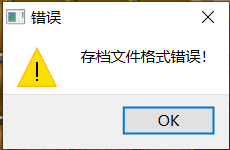
  从剪贴板读档功能则会显示出与上文中相同的空白剪贴板，玩家将相同格式的字符串复制进来之后点击完成即可成功读档。字符串除了通过保存到剪贴板功能获得之外，还可以从硬盘存档文件的最后一行获得
 使用从硬盘读档的方法能够和正常局面一样悔棋和重下，而使用字符串方法读档能够悔棋（显然重下是无法进行的，因为根本没有包含在字符串里）